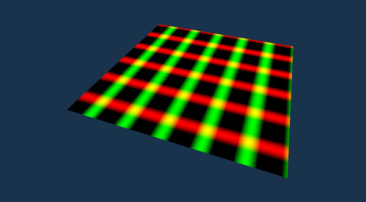
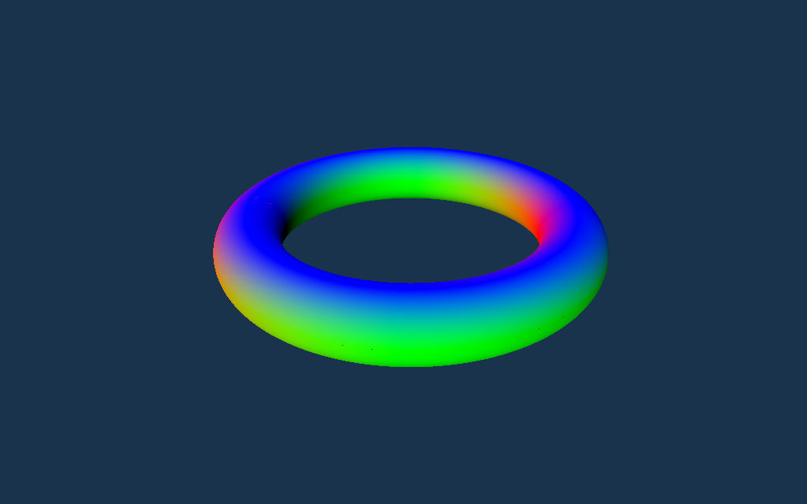

# About

* Live-coding of parametric functions in WebGPU. 
* Currently only works in the nightly dev version of Chrome: [Chrome Canary](https://www.google.com/chrome/canary/).
* To enable WebGPU, start Canary with the ```--enable-unsafe-webgpu``` flag.

TODO:

* Camera position is currently not stored in sharable URL.

# Getting Started

Start by modifying the samplePosition() function. You can also modify the vertex and fragment shaders for full control over procedural geometry and textures. Note that there are two vertex shaders - one for triangle and another one for point primitives.

The shader code is stored as part of the URL. You can simply copy & paste the URL to share the results. 

# Examples

## Example 1:

Modified version of a parametric function in the [mathworks examples](https://in.mathworks.com/help/symbolic/ezsurf.html). 

URL: https://users.cg.tuwien.ac.at/mschuetz/parametric/parametric.html


## Example 2:

Simple plane geometry, colored and animated by the fragment shader.

URL: [https://users.cg.tuwien.ac.at/mschuetz/parametric/parametric.html?primitive=triangles&resolution=164&shadercode=Ci8vIC0gbW9kaWZ5IHNhbX ...](https://users.cg.tuwien.ac.at/mschuetz/parametric/parametric.html?primitive=triangles&resolution=164&shadercode=Ci8vIC0gbW9kaWZ5IHNhbXBsZVBvc2l0aW9uKCkgdG8gc3BlY2lmeSB0aGUgc2hhcGUgb2YgeW91ciBwYXJhbWV0cmljIGZ1bmN0aW9uCi8vIC0gY29tcGlsYXRpb24gaXMgYXV0b21hdGljYWxseSBkb25lIHdoaWxlIHR5cGluZwovLyAtIGlmIHlvdSBlbmNvdW50ZXIgY29tcGlsYXRpb24gZXJyb3JzIChyZWQgYmFja2dyb3VuZCksIAovLyAgIGNoZWNrIHRoZSBkZXYgY29uc29sZSBmb3IgZGV0YWlscwoKW1tibG9ja11dIHN0cnVjdCBVbmlmb3JtcyB7Cgl3b3JsZFZpZXcgICAgICAgICAgOiBtYXQ0eDQ8ZjMyPjsKCXByb2ogICAgICAgICAgICAgICA6IG1hdDR4NDxmMzI%2BOwoJc2NyZWVuX3dpZHRoICAgICAgIDogZjMyOwoJc2NyZWVuX2hlaWdodCAgICAgIDogZjMyOwoJdGltZSAgICAgICAgICAgICAgIDogZjMyOwoJcmVzb2x1dGlvbiAgICAgICAgIDogdTMyOwp9OwoKW1tiaW5kaW5nKDApLCBncm91cCgwKV1dIHZhcjx1bmlmb3JtPiB1bmlmb3JtcyA6IFVuaWZvcm1zOwoKbGV0IFBJID0gMy4xNDE1OwoKLy8gc2VlIGh0dHBzOi8vaW4ubWF0aHdvcmtzLmNvbS9oZWxwL3N5bWJvbGljL2V6c3VyZi5odG1sCmZuIHNhbXBsZVBvc2l0aW9uKHUgOiBmMzIsIHYgOiBmMzIpIC0%2BIHZlYzQ8ZjMyPiB7CgoJdmFyIHMgPSAyLjAgKiBQSSAqIHUgLSBQSTsKCXZhciB0ID0gMi4wICogUEkgKiB2IC0gUEk7CgoJdmFyIHggPSBzOwoJdmFyIHkgPSB0OwoJdmFyIHogPSAwLjA7CgoJcmV0dXJuIHZlYzQ8ZjMyPih4LCB5LCB6LCAxLjApOwp9CgpzdHJ1Y3QgVmVydGV4SW57CglbW2J1aWx0aW4odmVydGV4X2luZGV4KV1dIGluZGV4IDogdTMyOwp9OwoKc3RydWN0IFZlcnRleE91dHsKCVtbYnVpbHRpbihwb3NpdGlvbildXSBwb3MgOiB2ZWM0PGYzMj47CglbW2xvY2F0aW9uKDApXV0gdXY6IHZlYzI8ZjMyPjsKfTsKCnN0cnVjdCBGcmFnbWVudEluewoJW1tsb2NhdGlvbigwKV1dIHV2OiB2ZWMyPGYzMj47Cn07CgpzdHJ1Y3QgRnJhZ21lbnRPdXR7CglbW2xvY2F0aW9uKDApXV0gY29sb3IgOiB2ZWM0PGYzMj47Cn07CgovLyB2ZXJ0ZXggc2hhZGVyIGZvciB0cmlhbmdsZSBwcmltaXRpdmVzCltbc3RhZ2UodmVydGV4KV1dCmZuIG1haW5fdmVydGV4X3RyaWFuZ2xlcyh2ZXJ0ZXggOiBWZXJ0ZXhJbikgLT4gVmVydGV4T3V0IHsKCglpZ25vcmUodW5pZm9ybXMpOwoKCXZhciBRVUFEX09GRlNFVFMgOiBhcnJheTx2ZWMzPGYzMj4sIDY%2BID0gYXJyYXk8dmVjMzxmMzI%2BLCA2PigKCQl2ZWMzPGYzMj4oIDAuMCwgMC4wLCAwLjApLAoJCXZlYzM8ZjMyPiggMS4wLCAwLjAsIDAuMCksCgkJdmVjMzxmMzI%2BKCAxLjAsIDEuMCwgMC4wKSwKCgkJdmVjMzxmMzI%2BKCAwLjAsIDAuMCwgMC4wKSwKCQl2ZWMzPGYzMj4oIDEuMCwgMS4wLCAwLjApLAoJCXZlYzM8ZjMyPiggMC4wLCAxLjAsIDAuMCksCgkpOwoJCgl2YXIgc3BhY2luZyA9IDEuMCAvIGYzMih1bmlmb3Jtcy5yZXNvbHV0aW9uKTsKCgl2YXIgbG9jYWxWZXJ0ZXhJbmRleCA9IHZlcnRleC5pbmRleCAlIDZ1OwoJdmFyIGl4ID0gKHZlcnRleC5pbmRleCAvIDZ1KSAlIHVuaWZvcm1zLnJlc29sdXRpb247Cgl2YXIgaXkgPSAodmVydGV4LmluZGV4IC8gNnUpIC8gdW5pZm9ybXMucmVzb2x1dGlvbjsKCgl2YXIgdSA9IGYzMihpeCkgLyBmMzIodW5pZm9ybXMucmVzb2x1dGlvbik7Cgl2YXIgdiA9IGYzMihpeSkgLyBmMzIodW5pZm9ybXMucmVzb2x1dGlvbik7Cgl1ID0gdSArIFFVQURfT0ZGU0VUU1tsb2NhbFZlcnRleEluZGV4XS54ICogc3BhY2luZyAqIDEuMDsKCXYgPSB2ICsgUVVBRF9PRkZTRVRTW2xvY2FsVmVydGV4SW5kZXhdLnkgKiBzcGFjaW5nICogMS4wOwoKCXZhciB3b3JsZFBvcyA9IHNhbXBsZVBvc2l0aW9uKHUsIHYpOwoKCXZhciB2aWV3UG9zID0gdW5pZm9ybXMud29ybGRWaWV3ICogd29ybGRQb3M7Cgl2YXIgcHJvalBvcyA9IHVuaWZvcm1zLnByb2ogKiB2aWV3UG9zOwoKCXZhciB2b3V0IDogVmVydGV4T3V0OwoJdm91dC5wb3MgPSBwcm9qUG9zOwoJdm91dC51diA9IHZlYzI8ZjMyPih1LCB2KTsKCglyZXR1cm4gdm91dDsKfQoKLy8gdmVydGV4IHNoYWRlciBmb3IgcG9pbnQgcHJpbWl0aXZlcwpbW3N0YWdlKHZlcnRleCldXQpmbiBtYWluX3ZlcnRleF9wb2ludHModmVydGV4IDogVmVydGV4SW4pIC0%2BIFZlcnRleE91dCB7CgoJaWdub3JlKHVuaWZvcm1zKTsKCQoJdmFyIHNwYWNpbmcgPSAxLjAgLyBmMzIodW5pZm9ybXMucmVzb2x1dGlvbik7CgoJdmFyIGxvY2FsVmVydGV4SW5kZXggPSB2ZXJ0ZXguaW5kZXggJSA2dTsKCXZhciBpeCA9IHZlcnRleC5pbmRleCAlIHVuaWZvcm1zLnJlc29sdXRpb247Cgl2YXIgaXkgPSB2ZXJ0ZXguaW5kZXggLyB1bmlmb3Jtcy5yZXNvbHV0aW9uOwoKCXZhciB1ID0gZjMyKGl4KSAvIGYzMih1bmlmb3Jtcy5yZXNvbHV0aW9uKTsKCXZhciB2ID0gZjMyKGl5KSAvIGYzMih1bmlmb3Jtcy5yZXNvbHV0aW9uKTsKCgl2YXIgd29ybGRQb3MgPSBzYW1wbGVQb3NpdGlvbih1LCB2KTsKCXZhciB2aWV3UG9zID0gdW5pZm9ybXMud29ybGRWaWV3ICogd29ybGRQb3M7Cgl2YXIgcHJvalBvcyA9IHVuaWZvcm1zLnByb2ogKiB2aWV3UG9zOwoKCXZhciB2b3V0IDogVmVydGV4T3V0OwoJdm91dC5wb3MgPSBwcm9qUG9zOwoJdm91dC51diA9IHZlYzI8ZjMyPih1LCB2KTsKCglyZXR1cm4gdm91dDsKfQoKW1tzdGFnZShmcmFnbWVudCldXQpmbiBtYWluX2ZyYWdtZW50KGZyYWdtZW50IDogRnJhZ21lbnRJbikgLT4gRnJhZ21lbnRPdXQgewoKCWlnbm9yZSh1bmlmb3Jtcyk7CgoJdmFyIGZvdXQgOiBGcmFnbWVudE91dDsKCgl2YXIgdXYgPSBmcmFnbWVudC51djsKCgl2YXIgYSA9IGNvcygzNS4wICogdXYueCArIDUuMCAqIHVuaWZvcm1zLnRpbWUpOwogICAgdmFyIGIgPSBzaW4oMzUuMCAqIHV2LnkgKyA1LjAgKiB1bmlmb3Jtcy50aW1lKTsKCglmb3V0LmNvbG9yID0gdmVjNDxmMzI%2BKGEsIGIsIDAuMCwgMS4wKTsKCgoJcmV0dXJuIGZvdXQ7Cn0KCgoKCg%3D%3D)


## Example 3

URL: [https://users.cg.tuwien.ac.at/mschuetz/parametric/parametric.html?primitive=triangles&resolution=649&shadercode=Ci8vIC0gb ...](https://users.cg.tuwien.ac.at/mschuetz/parametric/parametric.html?primitive=triangles&resolution=649&shadercode=Ci8vIC0gbW9kaWZ5IHNhbXBsZVBvc2l0aW9uKCkgdG8gc3BlY2lmeSB0aGUgc2hhcGUgb2YgeW91ciBwYXJhbWV0cmljIGZ1bmN0aW9uCi8vIC0gY29tcGlsYXRpb24gaXMgYXV0b21hdGljYWxseSBkb25lIHdoaWxlIHR5cGluZwovLyAtIGlmIHlvdSBlbmNvdW50ZXIgY29tcGlsYXRpb24gZXJyb3JzIChyZWQgYmFja2dyb3VuZCksIAovLyAgIGNoZWNrIHRoZSBkZXYgY29uc29sZSBmb3IgZGV0YWlscwoKW1tibG9ja11dIHN0cnVjdCBVbmlmb3JtcyB7Cgl3b3JsZFZpZXcgICAgICAgICAgOiBtYXQ0eDQ8ZjMyPjsKCXByb2ogICAgICAgICAgICAgICA6IG1hdDR4NDxmMzI%2BOwoJc2NyZWVuX3dpZHRoICAgICAgIDogZjMyOwoJc2NyZWVuX2hlaWdodCAgICAgIDogZjMyOwoJdGltZSAgICAgICAgICAgICAgIDogZjMyOwoJcmVzb2x1dGlvbiAgICAgICAgIDogdTMyOwp9OwoKW1tiaW5kaW5nKDApLCBncm91cCgwKV1dIHZhcjx1bmlmb3JtPiB1bmlmb3JtcyA6IFVuaWZvcm1zOwoKLy8gc2VlIGh0dHBzOi8vaW4ubWF0aHdvcmtzLmNvbS9oZWxwL3N5bWJvbGljL2V6c3VyZi5odG1sCmZuIHNhbXBsZVBvc2l0aW9uKHUgOiBmMzIsIHYgOiBmMzIpIC0%2BIHZlYzQ8ZjMyPiB7CgoJdmFyIHMgPSB1ICogMi4wICogMy4xNDE1OwoJdmFyIHQgPSB2ICogMi4wICogMy4xNDE1OwoKCXZhciBhID0gMS4wOwoJdmFyIGIgPSAwLjI7CgoJdmFyIHggPSAoYSArIGIgKiBjb3ModCkpICogY29zKHMpOwoJdmFyIHkgPSAoYSArIGIgKiBjb3ModCkpICogc2luKHMpOwoJdmFyIHogPSBiICogc2luKHQpOwoKCXJldHVybiB2ZWM0PGYzMj4oeCwgeSwgeiwgMS4wKTsKfQoKZm4gc2FtcGxlQ29sb3IodSA6IGYzMiwgdiA6IGYzMiwgc3BhY2luZyA6IGYzMikgLT4gdmVjNDxmMzI%2BIHsKCgl2YXIgZGVsdGEgPSA0MC4wIC8gMTAwMC4wOwoKCXZhciB4XzAgPSBzYW1wbGVQb3NpdGlvbih1IC0gZGVsdGEsIHYpOwoJdmFyIHhfMSA9IHNhbXBsZVBvc2l0aW9uKHUgKyBkZWx0YSwgdik7Cgl2YXIgeV8wID0gc2FtcGxlUG9zaXRpb24odSwgdiAtIGRlbHRhKTsKCXZhciB5XzEgPSBzYW1wbGVQb3NpdGlvbih1LCB2ICsgZGVsdGEpOwoKCXZhciBhID0gbm9ybWFsaXplKHhfMSAtIHhfMCkueHl6OwoJdmFyIGIgPSBub3JtYWxpemUoeV8xIC0geV8wKS54eXo7Cgl2YXIgTiA9IGNyb3NzKGEsIGIpOwoKCXJldHVybiB2ZWM0PGYzMj4oTiwgMS4wKTsKfQoKc3RydWN0IFZlcnRleEluewoJW1tidWlsdGluKHZlcnRleF9pbmRleCldXSBpbmRleCA6IHUzMjsKfTsKCnN0cnVjdCBWZXJ0ZXhPdXR7CglbW2J1aWx0aW4ocG9zaXRpb24pXV0gcG9zIDogdmVjNDxmMzI%2BOwoJW1tsb2NhdGlvbigwKV1dIGNvbG9yIDogdmVjNDxmMzI%2BOwp9OwoKc3RydWN0IEZyYWdtZW50SW57CglbW2xvY2F0aW9uKDApXV0gY29sb3IgOiB2ZWM0PGYzMj47Cn07CgpzdHJ1Y3QgRnJhZ21lbnRPdXR7CglbW2xvY2F0aW9uKDApXV0gY29sb3IgOiB2ZWM0PGYzMj47Cn07CgovLyB2ZXJ0ZXggc2hhZGVyIGZvciB0cmlhbmdsZSBwcmltaXRpdmVzCltbc3RhZ2UodmVydGV4KV1dCmZuIG1haW5fdmVydGV4X3RyaWFuZ2xlcyh2ZXJ0ZXggOiBWZXJ0ZXhJbikgLT4gVmVydGV4T3V0IHsKCglpZ25vcmUodW5pZm9ybXMpOwoKCXZhciBRVUFEX09GRlNFVFMgOiBhcnJheTx2ZWMzPGYzMj4sIDY%2BID0gYXJyYXk8dmVjMzxmMzI%2BLCA2PigKCQl2ZWMzPGYzMj4oIDAuMCwgMC4wLCAwLjApLAoJCXZlYzM8ZjMyPiggMS4wLCAwLjAsIDAuMCksCgkJdmVjMzxmMzI%2BKCAxLjAsIDEuMCwgMC4wKSwKCgkJdmVjMzxmMzI%2BKCAwLjAsIDAuMCwgMC4wKSwKCQl2ZWMzPGYzMj4oIDEuMCwgMS4wLCAwLjApLAoJCXZlYzM8ZjMyPiggMC4wLCAxLjAsIDAuMCksCgkpOwoJCgl2YXIgc3BhY2luZyA9IDEuMCAvIGYzMih1bmlmb3Jtcy5yZXNvbHV0aW9uKTsKCgl2YXIgbG9jYWxWZXJ0ZXhJbmRleCA9IHZlcnRleC5pbmRleCAlIDZ1OwoJdmFyIGl4ID0gKHZlcnRleC5pbmRleCAvIDZ1KSAlIHVuaWZvcm1zLnJlc29sdXRpb247Cgl2YXIgaXkgPSAodmVydGV4LmluZGV4IC8gNnUpIC8gdW5pZm9ybXMucmVzb2x1dGlvbjsKCgl2YXIgdSA9IGYzMihpeCkgLyBmMzIodW5pZm9ybXMucmVzb2x1dGlvbik7Cgl2YXIgdiA9IGYzMihpeSkgLyBmMzIodW5pZm9ybXMucmVzb2x1dGlvbik7Cgl1ID0gdSArIFFVQURfT0ZGU0VUU1tsb2NhbFZlcnRleEluZGV4XS54ICogc3BhY2luZyAqIDEuMDsKCXYgPSB2ICsgUVVBRF9PRkZTRVRTW2xvY2FsVmVydGV4SW5kZXhdLnkgKiBzcGFjaW5nICogMS4wOwoKCXZhciB3b3JsZFBvcyA9IHNhbXBsZVBvc2l0aW9uKHUsIHYpOwoKCXZhciB2aWV3UG9zID0gdW5pZm9ybXMud29ybGRWaWV3ICogd29ybGRQb3M7Cgl2YXIgcHJvalBvcyA9IHVuaWZvcm1zLnByb2ogKiB2aWV3UG9zOwoKCXZhciB2b3V0IDogVmVydGV4T3V0OwoJdm91dC5wb3MgPSBwcm9qUG9zOwoJdm91dC5jb2xvciA9IHNhbXBsZUNvbG9yKHUsIHYsIHNwYWNpbmcpOwoKCXJldHVybiB2b3V0Owp9CgovLyB2ZXJ0ZXggc2hhZGVyIGZvciBwb2ludCBwcmltaXRpdmVzCltbc3RhZ2UodmVydGV4KV1dCmZuIG1haW5fdmVydGV4X3BvaW50cyh2ZXJ0ZXggOiBWZXJ0ZXhJbikgLT4gVmVydGV4T3V0IHsKCglpZ25vcmUodW5pZm9ybXMpOwoJCgl2YXIgc3BhY2luZyA9IDEuMCAvIGYzMih1bmlmb3Jtcy5yZXNvbHV0aW9uKTsKCgl2YXIgbG9jYWxWZXJ0ZXhJbmRleCA9IHZlcnRleC5pbmRleCAlIDZ1OwoJdmFyIGl4ID0gdmVydGV4LmluZGV4ICUgdW5pZm9ybXMucmVzb2x1dGlvbjsKCXZhciBpeSA9IHZlcnRleC5pbmRleCAvIHVuaWZvcm1zLnJlc29sdXRpb247CgoJdmFyIHUgPSBmMzIoaXgpIC8gZjMyKHVuaWZvcm1zLnJlc29sdXRpb24pOwoJdmFyIHYgPSBmMzIoaXkpIC8gZjMyKHVuaWZvcm1zLnJlc29sdXRpb24pOwoKCXZhciB3b3JsZFBvcyA9IHNhbXBsZVBvc2l0aW9uKHUsIHYpOwoJdmFyIHZpZXdQb3MgPSB1bmlmb3Jtcy53b3JsZFZpZXcgKiB3b3JsZFBvczsKCXZhciBwcm9qUG9zID0gdW5pZm9ybXMucHJvaiAqIHZpZXdQb3M7CgoJdmFyIHZvdXQgOiBWZXJ0ZXhPdXQ7Cgl2b3V0LnBvcyA9IHByb2pQb3M7Cgl2b3V0LmNvbG9yID0gc2FtcGxlQ29sb3IodSwgdiwgc3BhY2luZyk7CgoJcmV0dXJuIHZvdXQ7Cn0KCltbc3RhZ2UoZnJhZ21lbnQpXV0KZm4gbWFpbl9mcmFnbWVudChmcmFnbWVudCA6IEZyYWdtZW50SW4pIC0%2BIEZyYWdtZW50T3V0IHsKCglpZ25vcmUodW5pZm9ybXMpOwoKCXZhciBmb3V0IDogRnJhZ21lbnRPdXQ7Cglmb3V0LmNvbG9yID0gZnJhZ21lbnQuY29sb3I7CgoJcmV0dXJuIGZvdXQ7Cn0KCgoK)

